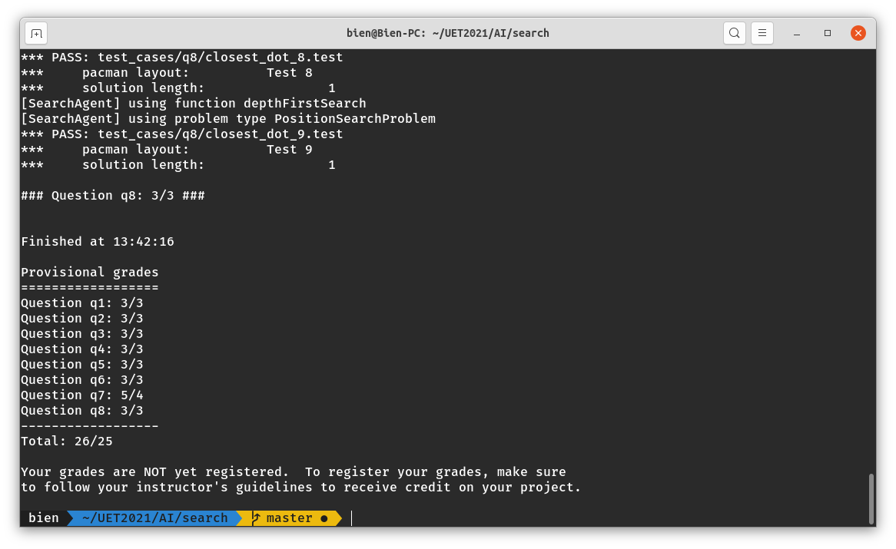

# Artificial Intelligence, Pacman Game (Fall 2020)

Bài tập môn trí tuệ nhân tạo INT3401 8. 
Bài tập sử dụng các thuật toán tìm kiếm BFS, DFS, UCS và A* trong tìm kiếm trạng thái.

Đề bài: http://ai.berkeley.edu/search.html

Kết quả 

Khởi chạy game ```python pacman.py```

#### Bài tập 1: Tìm kiếm trạng thái kết thúc bằng DFS
Tìm kiếm cách đi tới điểm ```(x, y)``` đích nào đó.

Node trong việc duyệt DFS được tạo 
bởi ```Node(state, path, cost)```. Trong đó ```state``` là trạng 
thái của node trong không gian trạng thái, ```path``` là đường 
đi từ ```starting_state```  đến```state``` hiện tại và ```cost``` là 
tổng chi phí để di chuyển trên ```path``` trên.

Action của agent có gồm di chuyển ```(S, W, E, N) ``` theo các hướng trên.

Phép duyệt sử dụng DFS dùng ```Stack``` để lựa chọn node tiếp theo thêm vào 
trong cây duyệt và được đảm bảo mỗi node duyệt đúng 1 hoặc không 
duyệt bằng cách sử dụng ```list_visited_state``` để lưu lại các node đã duyệt.

Cách duyệt này tìm đến lá sâu nhất có thể.
#### Bài tập 2: Tìm kiếm trạng thái kết thúc bằng BFS 
Tương tự như DFS nhưng sử dụng ```Queue``` để lựa chọn node tiếp 
theo. Cách duyệt này, các node gần node bắt đầu (theo path) sẽ được 
duyệt trước tiên.
#### Bài tập 3: Tìm kiếm trạng thái kết thúc bằng UCS 
Tương tự như DFS, BFS nhưng sử dụng ```Priority Queue``` đánh giá các node dựa trên 
```cost``` để lựa chọn node tiếp theo.
Các node gần node bắt đầu (theo cost) được duyệt trước tiên.

Node đích tới đầu tiên được đưa ra là tối ưu. 
#### Bài tập 4: Tìm kiếm trạng thái kết thúc bằng A* 
Tương tự như UCS nhưng đánh giá dựa trên một hàm ```hueristic``` (ở đây là manhattan) 
cộng với ```cost``` để đánh giá node tiếp theo nên đi trước tiên. 
Hám đánh giá đúng sẽ giảm được node duyệt so với UCS.

#### Bài tập 5: Thiết lập state, action và cost cho bài toán đi hết 4 góc 
Trạng thái của bài toán là tọa độ ```(x, y)``` của vị trí pacman và ```list_conner_visted``` để 
lưu các góc đã duyệt qua.
Action của agent có gồm di chuyển ```(S, W, E, N) ``` theo các hướng trên.
Chi phí cho mỗi lần di chuyển là 1 đơn vị.
### Bài tập 6: Hàm heuristic cho thuật toán A* ở bài tập số 5
Hàm heuristics được lựa chọn là hàm manhattan và mazeDisctanceho khoảng cách giữa các góc xa 
nhất so trong trạng hiện tại.

Hàm mazeDistance cho thời gian tốt hơn.

Hàmanhattan cho khoảng cách mahhatan giữa 2 điểm còn hàm mazeDistance cho khoảng cách thực trong game giữa 2 điểm.

### Bài tập 7: Ăn hết toàn bộ các hạt food trong game
Trạng thái state xác định bằng bảng ```grid_food``` gồm lựơng thức ăn còn lại.

Hàm heuristics được chọn là khoảng cách thực tới hạt thức ăn xa nhất.

### Bài tập 8: Tìm hạt gần nhất
Sử dụng BFS tìm kiếm với trạng thái kết thúc là tọa độ hạt thức ăn bất kì được đưa đến.
